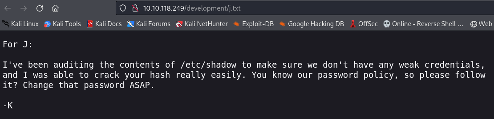

**RECON**

**NMAP**
```css
❯ sudo nmap -p- -sSCV --open --min-rate 5000 -Pn -n -v 10.10.19.38 -oA allPorts

   1   │ # Nmap 7.94 scan initiated Thu Aug 24 21:02:59 2023 as: nmap -p- -sSCV --open --min-rate 5000 -Pn -n -v -oA allPorts 10.10.19.38
   2   │ Nmap scan report for 10.10.19.38
   3   │ Host is up (0.069s latency).
   4   │ Not shown: 65529 closed tcp ports (reset)
   5   │ PORT     STATE SERVICE     VERSION
   6   │ 22/tcp   open  ssh         OpenSSH 7.2p2 Ubuntu 4ubuntu2.4 (Ubuntu Linux; protocol 2.0)
   7   │ | ssh-hostkey: 
   8   │ |   2048 db:45:cb:be:4a:8b:71:f8:e9:31:42:ae:ff:f8:45:e4 (RSA)
   9   │ |   256 09:b9:b9:1c:e0:bf:0e:1c:6f:7f:fe:8e:5f:20:1b:ce (ECDSA)
  10   │ |_  256 a5:68:2b:22:5f:98:4a:62:21:3d:a2:e2:c5:a9:f7:c2 (ED25519)
  11   │ 80/tcp   open  http        Apache httpd 2.4.18 ((Ubuntu))
  12   │ |_http-server-header: Apache/2.4.18 (Ubuntu)
  13   │ |_http-title: Site doesn't have a title (text/html).
  14   │ | http-methods: 
  15   │ |_  Supported Methods: OPTIONS GET HEAD POST
  16   │ 139/tcp  open  netbios-ssn Samba smbd 3.X - 4.X (workgroup: WORKGROUP)
  17   │ 445/tcp  open  0~Gd�U      Samba smbd 4.3.11-Ubuntu (workgroup: WORKGROUP)
  18   │ 8009/tcp open  ajp13       Apache Jserv (Protocol v1.3)
  19   │ | ajp-methods: 
  20   │ |_  Supported methods: GET HEAD POST OPTIONS
  21   │ 8080/tcp open  http        Apache Tomcat 9.0.7
  22   │ | http-methods: 
  23   │ |_  Supported Methods: GET HEAD POST OPTIONS
  24   │ |_http-favicon: Apache Tomcat
  25   │ |_http-title: Apache Tomcat/9.0.7
  26   │ Service Info: Host: BASIC2; OS: Linux; CPE: cpe:/o:linux:linux_kernel
  27   │ 
  28   │ Host script results:
  29   │ |_clock-skew: mean: 1h19m58s, deviation: 2h18m34s, median: -2s
  30   │ | smb-os-discovery: 
  31   │ |   OS: Windows 6.1 (Samba 4.3.11-Ubuntu)
  32   │ |   Computer name: basic2
  33   │ |   NetBIOS computer name: BASIC2\x00
  34   │ |   Domain name: \x00
  35   │ |   FQDN: basic2
  36   │ |_  System time: 2023-08-24T15:03:23-04:00
  37   │ | smb-security-mode: 
  38   │ |   account_used: guest
  39   │ |   authentication_level: user
  40   │ |   challenge_response: supported
  41   │ |_  message_signing: disabled (dangerous, but default)
  42   │ | smb2-time: 
  43   │ |   date: 2023-08-24T19:03:23
  44   │ |_  start_date: N/A
  45   │ | nbstat: NetBIOS name: BASIC2, NetBIOS user: <unknown>, NetBIOS MAC: <unknown> (unknown)
  46   │ | Names:
  47   │ |   BASIC2<00>           Flags: <unique><active>
  48   │ |   BASIC2<03>           Flags: <unique><active>
  49   │ |   BASIC2<20>           Flags: <unique><active>
  50   │ |   \x01\x02__MSBROWSE__\x02<01>  Flags: <group><active>
  51   │ |   WORKGROUP<00>        Flags: <group><active>
  52   │ |   WORKGROUP<1d>        Flags: <unique><active>
  53   │ |_  WORKGROUP<1e>        Flags: <group><active>
  54   │ | smb2-security-mode: 
  55   │ |   3:1:1: 
  56   │ |_    Message signing enabled but not required
  57   │ 
  58   │ Read data files from: /usr/bin/../share/nmap
  59   │ Service detection performed. Please report any incorrect results at https://nmap.org/submit/ .
  60   │ # Nmap done at Thu Aug 24 21:03:27 2023 -- 1 IP address (1 host up) scanned in 27.61 seconds
```

We have 6 open ports: 22(SSH), 80(HTTP), 139(SMB), 445(SMB), 8009(Jserv), 8080(Tomcat).

**Enumeration PORT:80**

**WEB**
Accessing the web page we can see that it is under maintenance with a note that says `"Please check back later"`.


If we see the source code we have a note that says the following `"Check our dev note section if you need to know what to work on."`.


**DIRECTORY LISTING**

We will perform a dictionary attack to list what hidden directories are on the website.
```css
❯ gobuster dir -u http://10.10.118.249/ -w /usr/share/wordlists/dirbuster/directory-list-2.3-medium.txt -t 20
===============================================================
Gobuster v3.6
by OJ Reeves (@TheColonial) & Christian Mehlmauer (@firefart)
===============================================================
[+] Url:                     http://10.10.118.249/
[+] Method:                  GET
[+] Threads:                 20
[+] Wordlist:                /usr/share/wordlists/dirbuster/directory-list-2.3-medium.txt
[+] Negative Status codes:   404
[+] User Agent:              gobuster/3.6
[+] Timeout:                 10s
===============================================================
Starting gobuster in directory enumeration mode
===============================================================
/development          (Status: 301) [Size: 320] [--> http://10.10.118.249/development/]
Progress: 4238 / 220561 (1.92%)^C
[!] Keyboard interrupt detected, terminating.
Progress: 4318 / 220561 (1.96%)
===============================================================
Finished
===============================================================

```

**/development/**

When we enter the development directory we can see that we have 2 .txt files.


**/development/dev.txt**

It appears to be a conversation between two potential users.

User -> J

User -> K


**/development/j.txt**

With this conversation we can understand that user "J" has a weak password that can be easily cracked.



**Enumeration PORT:139,445**

We can observe that there is a shared folder named `'Anonymous'` when using `smbclient`.

```css
❯ smbclient -L 10.10.19.38
Password for [WORKGROUP\anonimo]:

        Sharename       Type      Comment
        ---------       ----      -------
        Anonymous       Disk      
        IPC$            IPC       IPC Service (Samba Server 4.3.11-Ubuntu)
Reconnecting with SMB1 for workgroup listing.

        Server               Comment
        ---------            -------

        Workgroup            Master
        ---------            -------
        WORKGROUP            BASIC2

```
  
If we connect to the shared folder, we can see that there is a .txt file named staff.txt.


