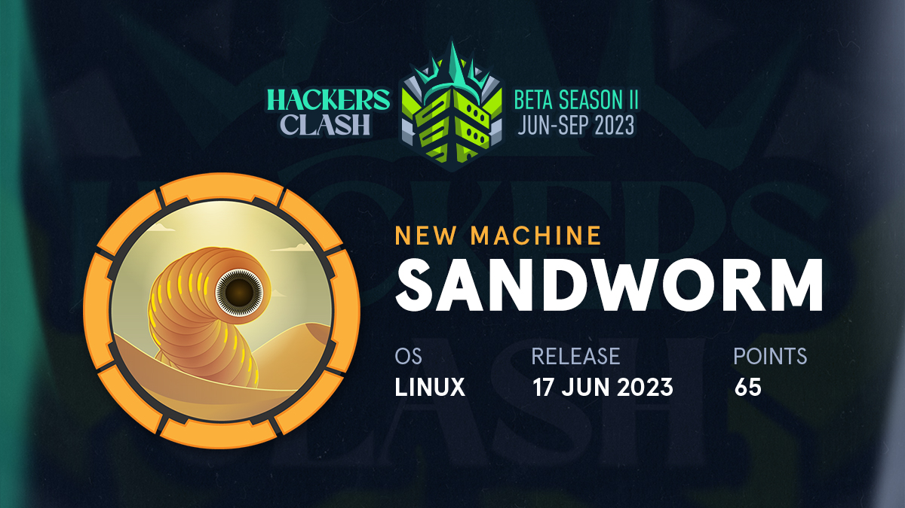
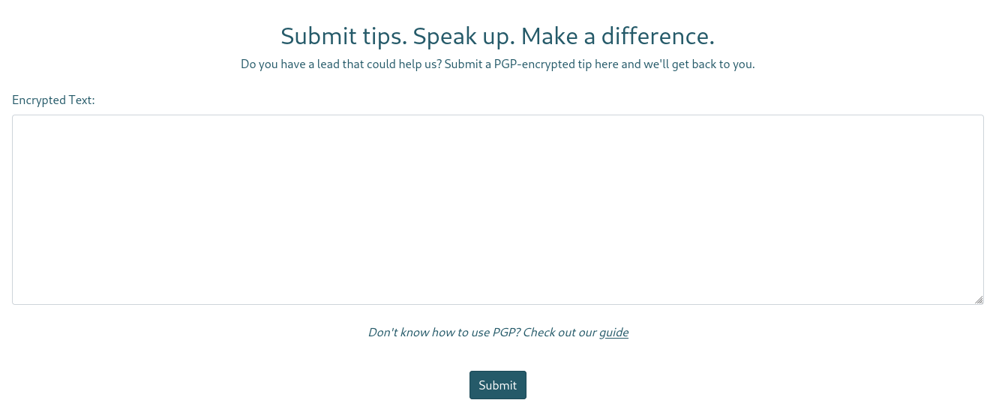
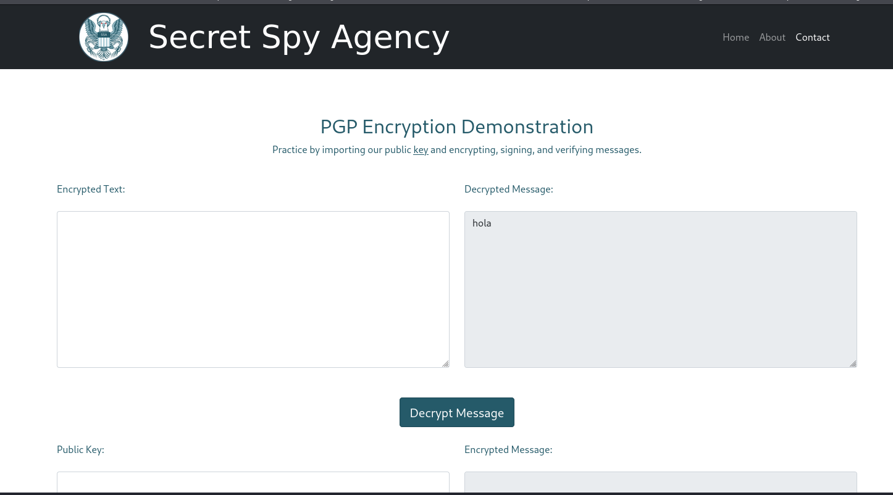
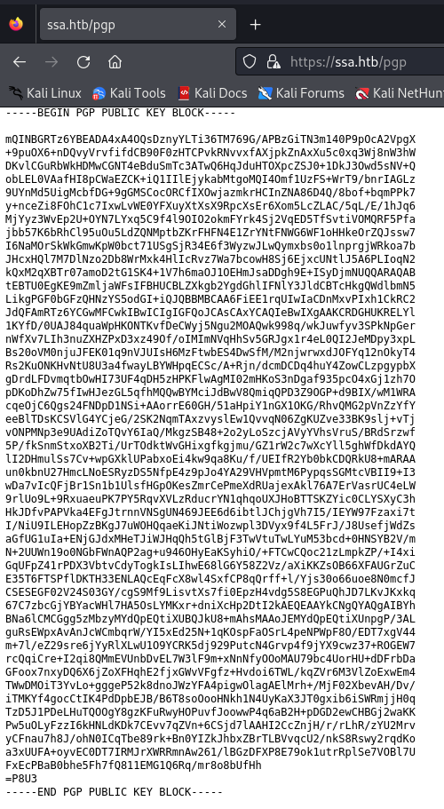

**RECON**

**PORTS SCAN**

We performed a scan of all possible open ports on the victim machine.

```ruby
❯ sudo nmap -p- -sS --open --min-rate 5000 -Pn -n -vvv 10.10.11.218 -oG allPorts
Starting Nmap 7.94 ( https://nmap.org ) at 2023-08-26 13:20 CEST
Initiating SYN Stealth Scan at 13:20
Scanning 10.10.11.218 [65535 ports]
Discovered open port 22/tcp on 10.10.11.218
Discovered open port 80/tcp on 10.10.11.218
Discovered open port 443/tcp on 10.10.11.218
Completed SYN Stealth Scan at 13:20, 11.42s elapsed (65535 total ports)
Nmap scan report for 10.10.11.218
Host is up, received user-set (0.052s latency).
Scanned at 2023-08-26 13:20:15 CEST for 12s
Not shown: 65330 closed tcp ports (reset), 202 filtered tcp ports (no-response)
Some closed ports may be reported as filtered due to --defeat-rst-ratelimit
PORT    STATE SERVICE REASON
22/tcp  open  ssh     syn-ack ttl 63
80/tcp  open  http    syn-ack ttl 63
443/tcp open  https   syn-ack ttl 63

Read data files from: /usr/bin/../share/nmap
Nmap done: 1 IP address (1 host up) scanned in 11.51 seconds
           Raw packets sent: 66953 (2.946MB) | Rcvd: 65535 (2.621MB)

```

**SERVICE AND VERSION SCAN**

```ruby
❯ sudo nmap -p22,80,443 -sCV 10.10.11.218 -oN target
[sudo] contraseña para anonimo: 
Starting Nmap 7.94 ( https://nmap.org ) at 2023-08-26 13:38 CEST
Nmap scan report for ssa.htb (10.10.11.218)
Host is up (0.050s latency).

PORT    STATE SERVICE  VERSION
22/tcp  open  ssh      OpenSSH 8.9p1 Ubuntu 3ubuntu0.1 (Ubuntu Linux; protocol 2.0)
| ssh-hostkey: 
|   256 b7:89:6c:0b:20:ed:49:b2:c1:86:7c:29:92:74:1c:1f (ECDSA)
|_  256 18:cd:9d:08:a6:21:a8:b8:b6:f7:9f:8d:40:51:54:fb (ED25519)
80/tcp  open  http     nginx 1.18.0 (Ubuntu)
|_http-server-header: nginx/1.18.0 (Ubuntu)
|_http-title: Did not follow redirect to https://ssa.htb/
443/tcp open  ssl/http nginx 1.18.0 (Ubuntu)
| ssl-cert: Subject: commonName=SSA/organizationName=Secret Spy Agency/stateOrProvinceName=Classified/countryName=SA
| Not valid before: 2023-05-04T18:03:25
|_Not valid after:  2050-09-19T18:03:25
|_http-server-header: nginx/1.18.0 (Ubuntu)
|_http-title: Secret Spy Agency | Secret Security Service
Service Info: OS: Linux; CPE: cpe:/o:linux:linux_kernel

Service detection performed. Please report any incorrect results at https://nmap.org/submit/ .
Nmap done: 1 IP address (1 host up) scanned in 15.37 seconds
```

We add the domain to the /etc/hosts file.

At the top of the page, there is a contact button that will redirect us to a form. This form is designed to send an encrypted PGP message. With this, we can check if there's a possibility of performing any kind of command execution.



If we look at the bottom of the text box, there is a link that redirects us to a guide. This guide involves sending a message using a public key, and the website allows us to practice with its own public key.



This is the GPG public key provided to us for conducting tests.



If we take a closer look at the guide, there's a signature verifier that allows us to use our own keys.


